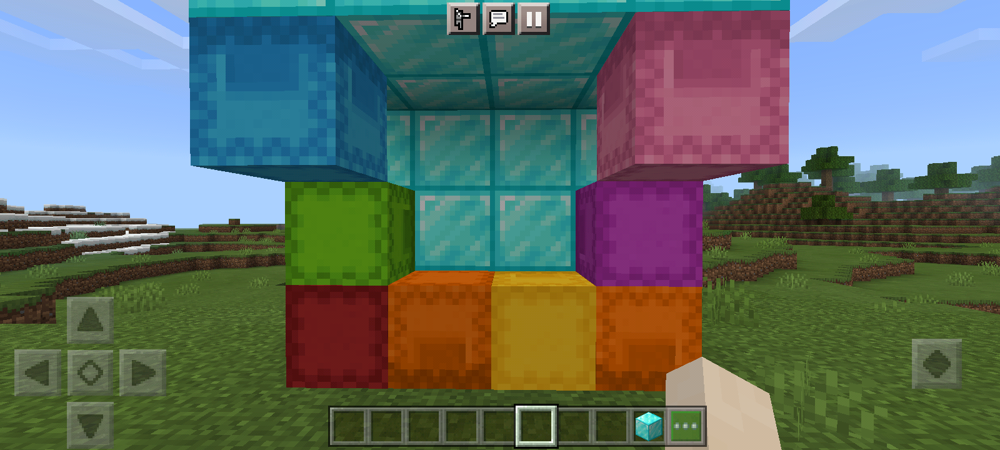

# Shulkerbox

Add functional ShulkerBox and working ShulkerBox rotation to your server!

## Feature
- [x] Add functional ShulkerBox
- [x] Working ShulkerBox rotation
- [x] Craft ShulkerBox and color it with dye
- [x] No duplicate ShulkerBox in creative mode

# Notes
If you edit recipes.json in plugin_data/Shulkerbox and you make a mistake, there crash may occurs. To fix it you just need to delete recipes.json and then restart the server
